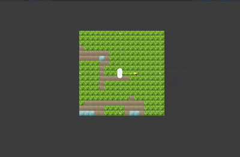

# Realtime WFC Generation (Unity)

Wave Function Collapse generated tile world around a moving camera in real time.

---

## What This Is

A Unity project that:

- Uses an overlapping Wave Function Collapse model to synthesize tiles.
- Maintains a visible square window of tiles around the player.
- Supports fixed sliding window regeneration and optional directional one‑row/column extensions.
- Rebuilds / constrains the model as the camera moves so exploration feels continuous.

|                                |                              |
| ------------------------------ | ---------------------------- |
|  |  |

---

## Usage

1. Clone project into a Unity project folder or import the `.zip` into an existing project.
2. Create Training:
   - Add an empty GameObject with a `TilePainter` component.
   - Assign prefab tiles to the palatte and paint an input scene.
   - Create a child with the `Training` component, click "compile".
3. Add an `OverlapWFC` component:
   - Assign the Training reference.
   - Set `N` (start with 2).
   - Set `baseVisibleSize` (e.g. 16 for a 16x16 tile view with a default camera).
   - Optionally tweak `seed`, `iterations` (0 = full solve).
4. Add `Player`:
   - Assign camera (or it will auto-grab `Camera.main`).
   - Assign the `OverlapWFC` instance.
5. Press Play:
   - Move with WASD / Arrow keys.
   - Tiles generate around you.

---

## Configuration Tips

- baseVisibleSize: Visible window (without overlap). Larger = broader view, more solve cost.
- N: Pattern size. Higher captures larger context, sharply increases pattern count and propagation cost.
- iterations:
  - 0 → run until solved or contradiction.
- seed: Reroll to vary generation.

---

## Known Issues

| Symptom                            | Cause                                   | Mitigation                                   |
| ---------------------------------- | --------------------------------------- | -------------------------------------------- |
| Grid flicker                       | Partial solves + frequent rebuild       | Set iterations=0 or lower rebuild frequency  |
| Big hitch when reversing direction | Full rebuild after extension add/remove | Remove directional extension or add debounce |
| Tiles render above player          | Sprite sorting layer/order mismatch     | Adjust SpriteRenderer sorting layers         |
| N=3 very slow                      | Pattern explosion                       | Lower baseVisibleSize, simplify sample       |

---

## Folder Layout

```
Assets/
  Player.cs
  unity-wave-function-collapse/
    OverlapWFC.cs
    impl/OverlappingModel.cs
    Training.cs
  Terrain/
    Grass.prefab
    Sand.prefab
    Water.prefab
```

---

## License

Base overlapping WFC algorithm: MIT (original mxgmn). This project code modifications: MIT.

---
